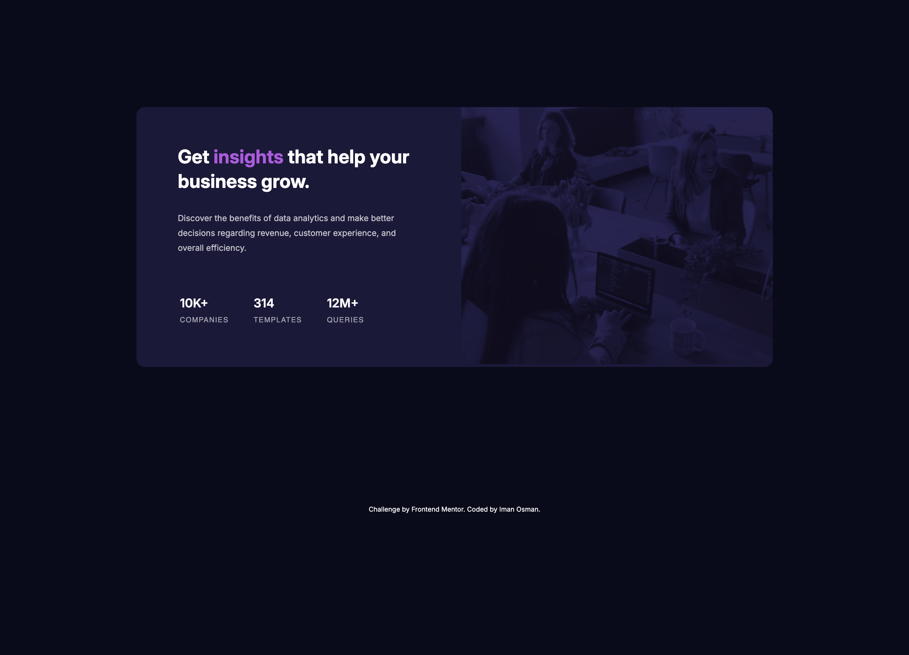
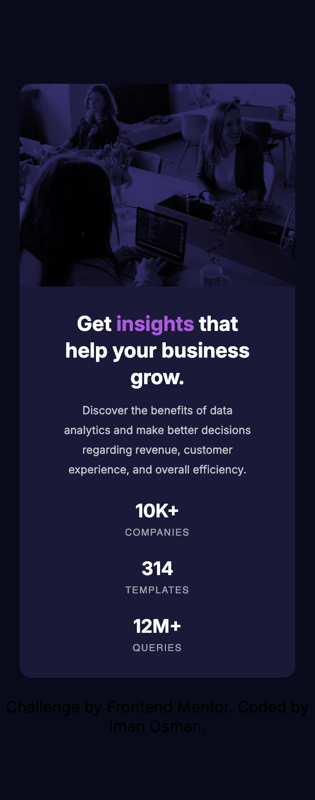

# Frontend Mentor - Stats preview card component solution

This is a solution to the [Stats preview card component challenge on Frontend Mentor](https://www.frontendmentor.io/challenges/stats-preview-card-component-8JqbgoU62).

## Table of contents

- [Overview](#overview)
- [Goal](#goal)
- [Outcome](#outcome)
- [My process](#my-process)
- [Built with](#built-with)
- [Feedback](#feedback)
- [Lessons](#lessons)
- [Take forward](#take-forward)
- [Useful resources](#useful-resources)

## Overview

This challenge asks that I create a responsive Flex layout using Sass.

## Goal

My focus here is to work efficiently and confidently as I've done a number of these layouts now. I also want to use some new design elements for the filter on the image too.

## Outcome

I'm happy with the outcome to an extent but I was unable to discover how to use the `blend-mode` on the image in the design to get the effect in the design. I feel I got close but not quite - It seems others struggled with this, too.

:jigsaw: [Live Site URL](https://i000o.github.io/stats-preview-card/)  
:pencil2: [Solution URL](https://www.frontendmentor.io/solutions/responsive-flex-stats-card-with-sass-r-sp2zl38i)

## Built with

:gear: Semantic HTML5 markup  
:gear: CSS Flex  
:gear: Mobile-first workflow  
:gear: Sass

## My process

:alien: First, I organised and structured my HTML as usual. This is one of my favourite parts of the process as it really helps to understand the problem I'm approaching and keep my code clean from the beginning.
:alien: Then, I structured my files, initialised the repo and began writing my `input.scss` file. I started by importing the font and my CSS reset at the top.
:alien: I approached this task after the New Year, so I wanted to get back to a place where I had a good flow state going after the holidays.
:alien: I found it difficult to create the blend mode design on the image in this brief. I learnt that like in Adobe softwares, there are `mix-blend-mode` properties with value like `multiply`, `screen`, `overlay` etc. While I tried a lot of these, I wasn't able to achieve the effect in the design.
:alien: My suspicion is that I need to include a white background on the image so that when the blend mode is applied, the outcome isn't so dark due to the high-contrast b&w image. But this is a guess and from looking at other devs' solutions, I couldn't quite place the best way to go about this. Hopefully, I will get some feedback on this so I can utilise it in future projects.
:alien: I referred to my code from another project to implement the 'art direction' technique in order to swap out mobile/desktop images where appropriate. This is a great feature of CSS and is so useful for responsive design.
:alien: Upon finishing and uploading for feedback, as well as asking for help on blend modes, I asked for help getting rid of a tiny sliver of space under the image on my desktop design. I think it's due to the `picture` element but I wasn't able to remove it. Hopefully somebody can help me with that.

## Time taken

:alarm_clock: Mobile: 1 hr
:alarm_clock: Desktop: 2 hrs

## Lessons

1. I've learnt how to organise my Sass files into a folder and produce them from the command line with `sass --watch sass/input.scss sass/output.css`.
2. Implemented art direction again.
3. I could've changed the tablet view at 768px with the image to make the design better at that viewport size.
4. I need to add landmarks at the beginning like `<main>`.

## Take forward

:grey_exclamation: I think I'd like to revert back to using a desktop-first workflow. I think it suits me better.
:grey_exclamation: Blend modes are not just an Adobe thing! CSS uses it, too :smile:
:grey_exclamation: Organising my Sass files into a seperate folder :drooling_face:
